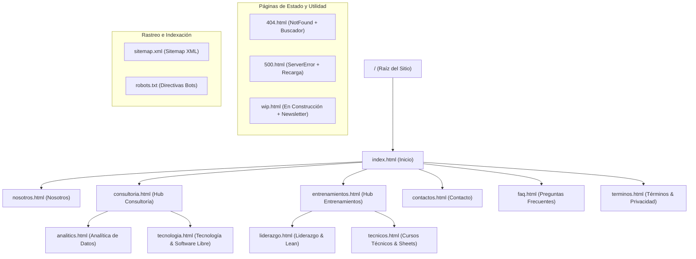

# 🛰️ Informe Integral del Proyecto - Oke Consulting

**Fecha de Generación:** 2026-09-02  
**Entorno de Ejecución:** HTML5 Semántico / CSS3 Modular (Variables) / JavaScript (Vanilla) / Python 3.x (.venv)  
**Dependencias de Node.js:** 0 (100% Estático Nativo)  
**Ruta del Repositorio:** `f:\okeconsulting\web\repo\pruebasweb`

---

## 1. Resumen Ejecutivo

El sitio web corporativo de **Oke Consulting** ha sido estructurado, optimizado y modernizado bajo una arquitectura web estática nativa de alto rendimiento. Todo el ecosistema opera de forma autónoma sin necesidad de herramientas de compilación externas ni dependencias de Node.js, siendo directamente ejecutable en cualquier navegador o servidor web estándar (Apache, Nginx, Python `http.server` o despliegue por FTP).

---

## 2. Mapa de Arquitectura y Árbol de Navegación



---

## 3. Inventario Completo de Archivos y Componentes

| Categoría | Archivo | Estado | Propósito y Contenido Principal |
| :--- | :--- | :---: | :--- |
| **Inicio** | `index.html` | ✅ Completo | Presentación institucional de Oke Consulting, pilares de servicio, video de Software Libre y botón CTA de contacto. |
| **Nosotros** | `nosotros.html` | ✅ Completo | Manifiesto fundacional, Misión, Visión, Valores y ciclo metodológico en 4 etapas (*Diagnóstico, Diseño, Implementación y Resultados*). |
| **Consultoría** | `consultoria.html` | ✅ Completo | Hub de servicios de consultoría con tarjetas interactivas hacia Analítica y Tecnología. |
| | `analitics.html` | ✅ Completo | Consultoría en Analítica de Datos e Inteligencia de Negocios, control de rentabilidad y procesos visuales. |
| | `tecnologia.html` | ✅ Completo | Consultoría en infraestructura TI, adopción de Software Libre y reducción de costos de licencias. |
| **Entrenamientos** | `entrenamientos.html` | ✅ Completo | Hub general de programas de capacitación empresarial y desarrollo de talento. |
| | `liderazgo.html` | ✅ Completo | Capacitación en Liderazgo Estratégico, Lean Management, oratoria y cadena de valor. |
| | `tecnicos.html` | ✅ Completo | Cursos prácticos de Google Sheets (desde cero hasta tableros) y herramientas digitales sin costo. |
| **Contacto & Soporte** | `contactos.html` | ✅ Completo | Formulario de contacto validado con feedback dinámico en cliente y canales de atención. |
| | `faq.html` | ✅ Completo | 16 preguntas y respuestas organizadas en 4 categorías temáticas con acordeón interactivo. |
| | `terminos.html` | ✅ Completo | Términos de servicio, propiedad total de datos por parte del cliente, NDA ético y garantía de 30 días. |
| **Páginas de Estado** | `404.html` | ✅ Completo | Manejador de error 404 con mensaje empático, buscador en tiempo real y accesos rápidos. |
| | `500.html` | ✅ Completo | Aviso de incidencia técnica con botón nativo para recargar la vista (`window.location.reload()`). |
| | `wip.html` | ✅ Completo | Plantilla para secciones en desarrollo con captura de suscriptores (formulario newsletter). |
| **Estilos CSS3** | `css/variables.css` | ✅ Activo | Tokens de diseño centralizados (`--oke-bg: #e2f9eb;`, `--oke-primary: #198754;`, sombras, radios). |
| | `css/components.css` | ✅ Activo | Componentes UI modernos (`.oke-navbar`, `.oke-card`, `.oke-accordion`, `.oke-form-card`, `.site-footer`). |
| | `css/style.css` | ✅ Activo | Hoja maestra unificada y modular. |
| **Interactividad JS** | `js/main.js` | ✅ Activo | Vanilla JS puro para menús móviles, buscador de 404, validación de formularios y newsletter. |
| **SEO & Rastreo** | `sitemap.xml` | ✅ Activo | Mapa XML con URLs canónicas, frecuencias de cambio (`<changefreq>`) y ponderaciones de prioridad. |
| | `robots.txt` | ✅ Activo | Directivas para motores de búsqueda con exclusión de páginas de utilidad y enlace al sitemap. |
| **Operaciones** | `deployftp.py` | ✅ Activo | Script de automatización de subida por FTP con patrones de exclusión de entornos locales. |
| | `AGENTS.md` | ✅ Activo | Especificaciones técnicas, identidad de marca y reglas del proyecto para agentes de IA. |

---

## 4. Identidad Visual y Tokens de Diseño

- **Color de Fondo Corporativo:** `--oke-bg: #e2f9eb;` (Verde menta suave característico).
- **Color Primario de Marca:** `--oke-primary: #198754;` | **Hover:** `--oke-primary-hover: #157347;`
- **Color de Texto Principal:** `--oke-dark: #212529;` | **Texto Secundario:** `--oke-text-muted: #6c757d;`
- **Dimensiones de Marca en Navbar:** `120x120 px` (`/img/logo_ed3.jpeg`).
- **Iconografía:** FontAwesome 6 CDN con espaciado consistente (`me-2` / `margin-right: 0.5rem`).
- **Comportamiento Visual:** Elevación suave al pasar el mouse en tarjetas (`transform: translateY(-4px);` con sombras `--oke-shadow-md`).

---

## 5. Auditoría de SEO Técnico, Semántica y Accesibilidad

1. **Metadatos en `<head>`:**
   - `<title>` optimizados para búsqueda (<=60 caracteres).
   - `<meta name="description">` persuasivas orientadas al CTR (120-155 caracteres).
   - `<link rel="canonical">` configurado en cada página.
   - Open Graph (`og:*`) y Twitter Cards completos con imágenes contextuales.
   - Directivas de robots: `index, follow` en páginas públicas y `noindex, nofollow` en páginas de utilidad (404, 500, wip).
2. **Jerarquía Semántica:**
   - Un único `<h1>` por página definiendo el tema principal.
   - `<h2>` para secciones principales y `<h3>` para tarjetas, acordeones y subsecciones.
3. **Datos Estructurados Schema.org (JSON-LD):**
   - `Organization` y `WebSite` con SearchAction en `index.html`.
   - `AboutPage` en `nosotros.html`.
   - `ProfessionalService` y `Service` en las áreas de consultoría.
   - `EducationalOccupationalProgram` y `Course` en las áreas de entrenamiento.
   - `FAQPage` con 13 preguntas estructuradas en `faq.html`.
   - `ContactPage` en `contactos.html`.
4. **Accesibilidad:**
   - Atributos `alt` descriptivos en el 100% de las imágenes (`/img/*`).
   - Atributos `aria-hidden="true"` en iconos decorativos.

---

## 6. Ecosistema de Subagentes Especializados

| Subagente | Nombre Interno | Misión Principal |
| :--- | :--- | :--- |
| **Agente 1** | `ux_copywriter` | Auditoría de estilo, tono de voz (*profesional pero accesible*), microcopias y CTAs. |
| **Agente 2** | `content_generator` | Generación de contenidos estratégicos para FAQ, Términos, Sobre Nosotros y artículos. |
| **Agente 3** | `seo_specialist` | Auditoría de SEO técnico, marcado Schema.org, metadatos y rastreo de bots. |

---

## 7. Despliegue y Mantenimiento

Para desplegar el sitio a producción mediante FTP:
```bash
# Configurar variables de entorno requeridas:
# FTP_SERVER, FTP_USERNAME, FTP_PASSWORD, FTP_REMOTE_PATH

python deployftp.py
```
*El script omitirá automáticamente `.git/`, `.venv/`, `.agents/`, `__pycache__/` y archivos locales temporales.*
